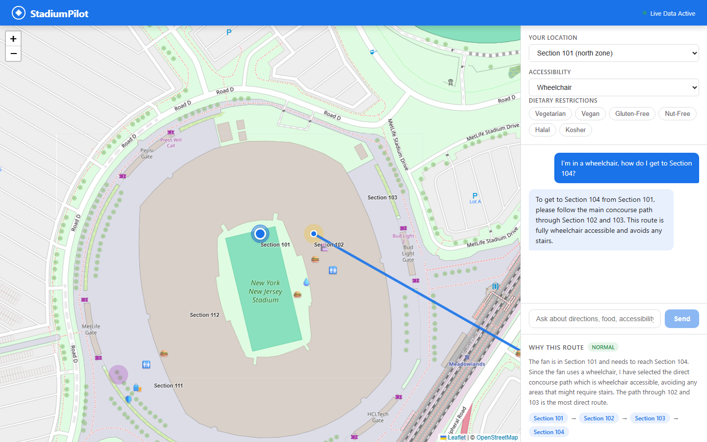

# StadiumPilot

AI concierge for stadium fans — built for the "Smart Stadiums and Tournament Operations"
GenAI hackathon challenge (2026 FIFA World Cup context).

## What it does
A fan asks a question in any language — "where's my seat," "nearest gate that isn't
crowded," "I'm in a wheelchair, how do I get to Section 214," "is there nut-free food near
me" — and StadiumPilot reasons over live stadium conditions (crowd density, gate status,
fan profile) to return a route **and** a plain-language explanation of why it recommended
that (explainable AI / XAI).

- **Persona:** Fan
- **Verticals:** Navigation + Multilingual Assistance + Accessibility
- **AI provider:** Google Gemini API (free tier) — see `PROMPT_DESIGN.md` for full prompt design
- **Built with:** OpenCode (Phase 1 foundation) + Claude Code (Phases 2-7) — see `task.md`



## Project docs
| File | Purpose |
|---|---|
| `task.md` | Phased build plan — what's done, what's next |
| `PROMPT_DESIGN.md` | The AI agent's system prompt, JSON output contract, edge-case behavior |
| `AGENTS.md` | Instructions auto-read by OpenCode |
| `CLAUDE.md` | Instructions auto-read by Claude Code |
| `tests/TESTING.md` | Unit test coverage + live edge-case test results |

## How to run
```bash
# Install dependencies (root + server + client)
npm run install:all

# Set up API key
cp .env.example server/.env
# Edit server/.env and add your GEMINI_API_KEY

# Start both server and client
npm run dev
```

- **Server:** http://localhost:3001
- **Client:** http://localhost:5173 (proxies /api to server)

## How to test
```bash
# Unit tests (pure logic, no API key needed, ~0.5s)
npm test

# Live edge-case suite (needs a running server with a real GEMINI_API_KEY)
npm run dev            # in one terminal
npm run test:edge-cases  # in another
```
See `tests/TESTING.md` for what each layer covers and the last recorded results.

## Live demo
[https://stadiumpilot-vzqn.onrender.com](https://stadiumpilot-vzqn.onrender.com)
(backend: `https://stadiumpilot-api.onrender.com` — Render free tier, first request after
idle may take ~30s to wake the backend)

## Tech stack
| Layer | Technology |
|---|---|
| Frontend | React 19 + Vite 6, Leaflet (react-leaflet) for maps |
| Backend | Node.js + Express, direct Gemini REST API calls (no SDK) |
| AI | Google Gemini API (`gemini-3.1-flash-lite`), structured JSON output |
| Deployment | Render — Web Service (backend) + Static Site (frontend), via `render.yaml` Blueprint |
| Data | Synthetic live stadium data — gate status and crowd density evolve statefully every 5s (gates mostly persist, crowds drift one level at a time). Clients fetch the static layout once and poll only the ~430-byte live payload. |

## Deploy to Render

The repo includes a `render.yaml` Blueprint that provisions both services in one
pass: `stadiumpilot-api` (Node Web Service, root dir `server`) and `stadiumpilot`
(Static Site, root dir `client`). Frontend and backend are separate origins on
Render, so the frontend is built with `VITE_API_BASE_URL` pointing at the
backend's URL (locally, the Vite dev server proxies `/api` to the backend
instead — no env var needed).

1. Push this repo to GitHub (Render deploys from a connected repo).
2. In the Render dashboard: **New > Blueprint**, select the repo. Render reads
   `render.yaml` and proposes both services.
3. Before the first deploy, set the required secret:
   - Select the `stadiumpilot-api` service → **Environment** tab → add
     `GEMINI_API_KEY` with your real Google AI Studio key. (`render.yaml`
     declares this var with `sync: false` so Render prompts for it rather than
     expecting it in the file — the key is never committed.)
4. Deploy. Render assigns each service a URL of the form
   `https://<service-name>.onrender.com`. `render.yaml` assumes
   `stadiumpilot-api` and `stadiumpilot` are available; if either name is
   already taken, Render will suffix it — in that case update `FRONTEND_URL`
   (on the backend service) and `VITE_API_BASE_URL` (on the frontend service)
   in the Render dashboard to match the real assigned URLs, then trigger a
   manual redeploy of both.
5. Verify end-to-end: open the frontend URL, send a chat message, and confirm
   a real (non-instant, varying) AI response comes back with a populated
   reasoning panel — that confirms the deployed backend is actually calling
   Gemini, not serving anything static.

Environment variables, summarized:
| Service | Variable | Where set | Purpose |
|---|---|---|---|
| `stadiumpilot-api` | `GEMINI_API_KEY` | Render dashboard (secret) | Server-side only, required |
| `stadiumpilot-api` | `FRONTEND_URL` | `render.yaml` / dashboard | Restricts CORS to the deployed frontend |
| `stadiumpilot` | `VITE_API_BASE_URL` | `render.yaml` / dashboard | Backend URL, baked in at build time |
